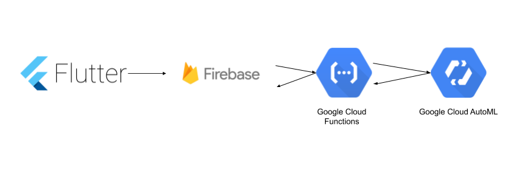
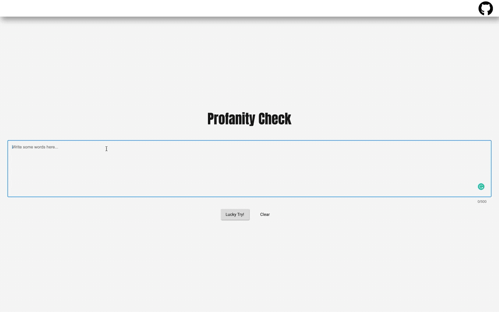

# Profanity Validation

  
 
- Usually text input, especially in e-mail and some related occasions, in addition to the validation of spelling, structure of words, maybe only the text grammar structure. For the proper use of those and whether there is profanity-level statements, currently rarely integrated into related applications.
- Using machine learning to construct related models can strengthen the test of whether the content of the text is appropriate.
- This repo shares a trained model and an open API for validation on the phrase, free to integrate in an English based app.

🚨WARNING🚨

For the demo and explanation purpose, this repository, all examples and data referenced may contain content which can be uncomfortable, please forgiven.

 
 
## Classification profanity Validation

- Hate speech
- Offensive language
- Normal

A mobile client https://profanity-check-c9365.web.app/

# Technical stack

- Google Cloud AutoML Tables: Model building
- Google Cloud Functions: Model REST API 
- Flutter: Client application on Web, mobile

# Client

- Flutter app

|     |   |   ||
|  :----: | :----:  |:----: |:----:|
|Android|iOS|macOS|WEB|

- HowTo

```markdown

Install flutter:

https://flutter.dev/docs/get-started/install

Check what you need to append to your flutter environment after installation:
$ flutter doctor


Enable for desktop:
$ flutter config --enable-macos-desktop
$ flutter create .

Enable for web:
$ flutter config --enable-web
$ flutter create .

Enable for mobile, nothing to do ....

List of target you want to debug:
$ flutter devices

Pixel 2 XL • 807KPQJ2004524 • android-arm64  • Android 10 (API 29)
macOS      • macOS          • darwin-x64     • Mac OS X 10.15.5 19F96
Web Server • web-server     • web-javascript • Flutter Tools
Chrome     • chrome         • web-javascript • Google Chrome 83.0.4103.97

Debug on different target platform:

on an Android
$ flutter run -d 807KPQJ2004524   <----- a device id

on desktop macOS
$ flutter run -d macOS

on web
$ flutter run -d chrome
```

# Web deploy

- Hosting https://profanity-check-c9365.web.app/ on **Firebase**.
- Must enable web development for Flutter:
    - `flutter config --enable-web`
    - `flutter create .`
   
```markdown
$ firebase login
$ firebase init
   -> * Hosting: ...
   -> * Use an existing project
   -> * ...public directory: build/web
   -> * single-page app 

Do some development, code change etc.......

$ flutter build web
!!! rm "rewrites" node in firebase.json
$ firebase deploy --only hosting
```

# Prediction model

- An open table from tweet feeds and classified by three types.
    - 0 - hate speech 1 - offensive language 2 - neither.
    - Download http://tinyurl.com/y8ylg8zo
- Use Google Cloud Tables(AutoML) to train the model.
- Deploy and host model on Google Cloud.
    - Mirror download http://tinyurl.com/y824odfu

# Prediction API

- A REST-API: https://profanity-check-c9365.web.app/profanityCheck2?q=[phrase you want to validate]

Example

https://profanity-check-c9365.web.app/profanityCheck2?q=hello

Output

```json
{
	"0": 0.093,
	"1": 0.389,
	"2": 0.519,
	"q": "hello"
}
```

>0 - hate speech 1 - offensive language 2 - neither.

- Hosted by cloud-function on Google Cloud

# API deploy

- Google Cloud Functions based
- [A tables-specific client for AutoML](https://googleapis.dev/python/automl/latest/gapic/v1beta1/tables.html) in Python
    - Can be done  with Javascript, Go, Java as well.
- Check [here](./functions/profanityCheck2.py)

# Plugin used

- async: ^2.4.1
- charts_flutter: ^0.9.0
- collection: ^1.14.12
- dio: ^3.0.9
- google_fonts: ^1.1.0
- package_info: ^0.4.1
- url_launcher: ^5.4.10

## License

```
Copyright 2020 Chris Xinyue Zhao

Permission is hereby granted, free of charge, to any person obtaining a copy of this software and associated documentation files (the "Software"), to deal in the Software without restriction, including without limitation the rights to use, copy, modify, merge, publish, distribute, sublicense, and/or sell copies of the Software, and to permit persons to whom the Software is furnished to do so, subject to the following conditions:

The above copyright notice and this permission notice shall be included in all copies or substantial portions of the Software.

THE SOFTWARE IS PROVIDED "AS IS", WITHOUT WARRANTY OF ANY KIND, EXPRESS OR IMPLIED, INCLUDING BUT NOT LIMITED TO THE WARRANTIES OF MERCHANTABILITY, FITNESS FOR A PARTICULAR PURPOSE AND NONINFRINGEMENT. IN NO EVENT SHALL THE AUTHORS OR COPYRIGHT HOLDERS BE LIABLE FOR ANY CLAIM, DAMAGES OR OTHER LIABILITY, WHETHER IN AN ACTION OF CONTRACT, TORT OR OTHERWISE, ARISING FROM, OUT OF OR IN CONNECTION WITH THE SOFTWARE OR THE USE OR OTHER DEALINGS IN THE SOFTWARE.
```

## Getting Started

This project is a starting point for a Flutter application.

A few resources to get you started if this is your first Flutter project:

- [Lab: Write your first Flutter app](https://flutter.dev/docs/get-started/codelab)
- [Cookbook: Useful Flutter samples](https://flutter.dev/docs/cookbook)

For help getting started with Flutter, view our
[online documentation](https://flutter.dev/docs), which offers tutorials,
samples, guidance on mobile development, and a full API reference.
